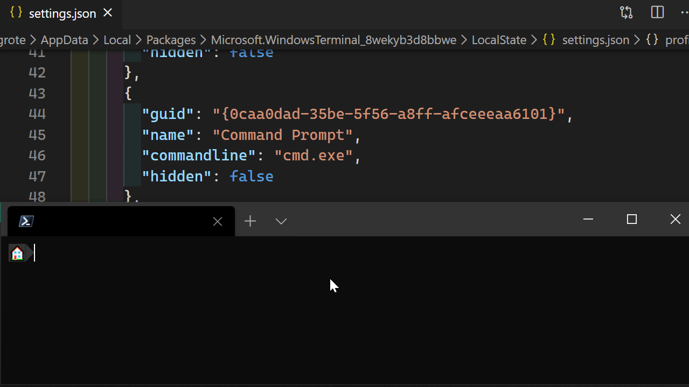
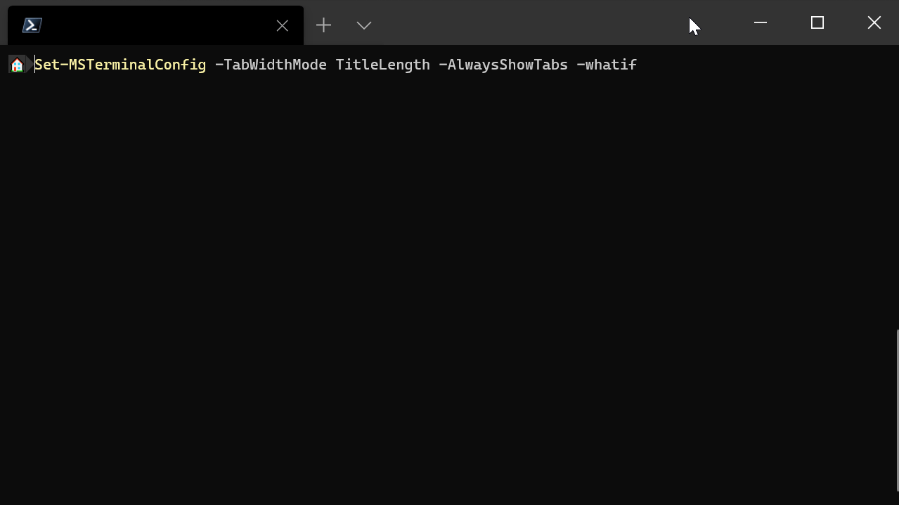

# Description

This module updates the settings.json file for the new [Windows Terminal](https://github.com/microsoft/terminal).

# Installation

The module is available from the [PowerShell Gallery](https://www.powershellgallery.com/packages/MSTerminalConfig) and can be installed using PowerShellGet

```
Install-Module -Name MSTerminalSettings
```

The module is supported on Powershell 5.1+

# 2.0 What's New

## QuickType-Powered Configuration
Object Types are generated from the [official Windows Terminal schema](https://aka.ms/terminal-profiles-schema), so configuration parameters are generated dynamically and input validated. Parameter help is also populated from the schema.

## Summary Views
Config and Profile objects have summary views by default, and Color Schemes auto-highlight the color being used


## Autocompletion and Filters
`Get-MSTerminalProfile` and `Get-MSTerminalColorScheme` will autocomplete the `Name` parameter with available profiles

You can also filter on any
property with wildcard syntax.


## Full Parameter Validation
Parameters are validated based on the validation in the json schema. True/False parameters are implemented as switches.

## Support for defaults and globals
Ability to apply settings for all profiles and "global" config settings. Set-MSTerminalProfile operates on these settings
by default if no profile is specified.


## Pipeline Support
`Get` commands can be piped to `Set`, `Add`, and `Remove` commands


## WhatIf Support
All Set and Add commands support -WhatIf and -Confirm with detail as to what is being changed


## Revamped Invoke-MSTerminalGif
Invoke-MSTerminalGif is more robust and includes backup/restore of settings, as well as better event cleanup via event
handling. It also now includes a -NoAsync option to run outside of a threadjob


# 2.0 Breaking Changes

### Extensive Parameter Changes
Now that parameters are dynamically retrieved and typed, their behavior may be different than 1.x. In general, they are
much stricter about what you can enter and things you could "get away with" in 1.x will now throw validation errors.

### Latest Windows Terminal Config Format Required
You must be using the 0.11+ style config format, previous config formats may not be parseable. Opening your config in
the latest version of Windows Terminal is usually sufficient to convert it to the correct format.

### No Comment Support
Comments will be removed from configs by the parsing engine due to a limitiation in QuickType

### TerminalSetting is now TerminalConfig
To avoid ambiguity between the "settings" file and an individual "setting", references to TerminalSetting is now
TerminalConfig for working with the entire configuration itself. Aliases have been created where appropriate but this
may break existing scripts.

### Windows Terminal Profile detection variable changed to $WT_PROFILE_ID
Windows Profile environment variable changed from $WT_PROFILE to $WT_PROFILE_ID since that has now been merged into
Windows Terminal, which will improve detection but profiles that explicity allow detection via $WT_PROFILE will need
to be modified.

### Improved Invoke-MSTerminalGif
Invoke-MSTerminalGif is more robust and takes a backup of the config prior to execution in case something goes awry.

# Examples

This example downloads the Pandora color scheme from [https://iterm2colorschemes.com/](https://iterm2colorschemes.com/)
and sets it as the color scheme for the PowerShell Core terminal profile.

```powershell
Invoke-RestMethod -Uri 'https://raw.githubusercontent.com/mbadolato/iTerm2-Color-Schemes/master/schemes/Pandora.itermcolors' -OutFile .\Pandora.itermcolors

Import-Iterm2ColorScheme -Path .\Pandora.itermcolors -Name Pandora

Get-MSTerminalProfile -Name "PowerShell Core" | Set-MSTerminalProfile -ColorScheme Pandora
```

This example creates a new profile for the PowerShell 7 preview using the PowerShell Hero logo.

```
$TerminalFolder = Find-MSTerminalFolder
Invoke-RestMethod -Uri 'https://github.com/PowerShell/PowerShell/raw/master/assets/StoreLogo-Preview.png' -OutFile "$TerminalFolder\StoreLogo-Preview.png"

$Pwsh7 = @{
    Name = "pwsh7-preview"
    CommandLine = 'C:\Program Files\PowerShell\7-preview\pwsh.exe'
    Icon = 'ms-appdata:///roaming/StoreLogo-Preview.png'
    ColorScheme = 'Campbell'
    FontFace = 'Consolas'
    StartingDirectory = '%USERPROFILE%'
}
New-MSTerminalProfile @Pwsh7
```

This example sets all your profiles to use a [programming font](https://app.programmingfonts.org/).  (Note the font must already be installed on your system)

```
Get-MSTerminalProfile | Set-MSTerminalProfile -FontFace "Fira Code Retina"
```
